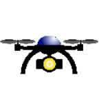

# DRONE

## Title
Proposal for Emoji: DRONE

## Submitter
Jonathan Dandois

## Date
YYYY-MM-DD

0. Abstract

This purpose of this proposal is to suggest that a new emoji be added to the Unicode Standards for a drone: aka, a UAV "unmanned aerial vehicle", quadcopter, multirotor, etc.  The proposed emoji art takes the form of a multirotor "quadcopter" distinguished by 3 main components:

    1. A chasis or frame with a body, arms, and legs.
    2. Motors and propellors located on the ends of the arms.
    3. A camera or other sensor payload mounted below the frame and between the legs.

These 3 components and imagery do not reflect the style or brand of any one vendor (for example DJI, Parrot, Yuneec, Autel, Skydio, etc.).  The authors feel that this is a ubiquitous symbol that can be recognized around the world to represent a small flying machine that may be flown manually or autonomously and most likely carries a camera sensor.

1. Identification
    - A. CLDR short name: ***drone***
    - B. Other keywords: ***uav, uas, multirotor, quadcopter, multicopter***
2. Images
    - A. **ZIP File**
    - B. **License**
        
        These drone images were created by Jonathan Dandois. I certify that the images are public domain and/or are subject to appropriate open source licenses, thereby making the images suitable for incorporation into the Unicode Standards
    - C. **Document** 18x18 and 72x72 
3. Category
    - A. **Category**
        - First Choice: 
            - ***[transport-air](https://unicode.org/emoji/charts/emoji-ordering.html#transport-air)***, after 🛸 ***flying saucer***
        - Other Choices:
            - ***[tool](https://unicode.org/emoji/charts/emoji-ordering.html#tool)***, after  ***ladder***
            - ***[other-object](https://unicode.org/emoji/charts/emoji-ordering.html#other-object)***, after ***identification card***
            - ***[light_&_video](https://unicode.org/emoji/charts/emoji-ordering.html#light_&_video)***, after 🪔 ***diya lamp***
4. Selection factors -- Inclusion
    - A. Compatibility
        - N/A
    - B. Expected Usage level
        - 1. Frequency
            - B.1.a Google Search
                - 769m results
                - https://www.google.com/search?q=drone
            - B.1.b Bing Search
                - 32m results
                - https://www4.bing.com/search?q=drone
            - B.1.c Google Video Search
                - 121m results
                - https://www.google.com/search?q=drone&tbm=vid
            - B.1.d Google Trends: Web Search
                - https://trends.google.com/trends/explore?date=all&q=elephant,drone
                - 
            - B.1.2 Google Trends: Image Search
                - https://trends.google.com/trends/explore?date=all_2008&gprop=images&q=elephant,drone
                - 
        - 2. Multiple usages
            - To "drone-on". e.g, "this lecture: 👩‍🏫 'drone-emoji' 'drone-emoji' 'drone-emoji'
                - "this professor drones on"
            - To refer humorously, or in the near future to the reality of a drone delivery: "'drone-emoji' 🧊🍻 pls"
            - for pro-drone sentiment...
            - for anti-drone sentiment...
            - for reporting on drones in the news / media (e.g., drone footage is frequently shared in social media in the current Russia-Ukraine conflict): "this new 'drone-emoji' footage 💥🤯"
        - 3. Use in sequences
        - 4. Breaking new ground
    - C. Distinctiveness
    - D. Completeness

5. Selection factors -- Exclusion
6. Other Information

