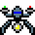

# DRONE

## Draft images 2022-04-25
18x18

72x72

## Title
Proposal for Emoji: DRONE

## Submitter
Jonathan Dandois

## Date
YYYY-MM-DD

1. Identification
    - A. CLDR short name: ***drone***
    - B. Other keywords: ***uav, uas, multirotor, quadcopter, multicopter***
2. Images
    - A. **ZIP File**
    - B. **License**
    - C. **Document** 18x18 and 72x72
3. Category
    - A. **Category**
        - First Choice: 
            - ***[transport-air](https://unicode.org/emoji/charts/emoji-ordering.html#transport-air)***, after 🛸 ***flying saucer***
        - Other Choices:
            - ***[tool](https://unicode.org/emoji/charts/emoji-ordering.html#tool)***, after  ***ladder***
            - ***[other-object](https://unicode.org/emoji/charts/emoji-ordering.html#other-object)***, after ***identification card***
            - ***[light_&_video](https://unicode.org/emoji/charts/emoji-ordering.html#light_&_video)***, after 🪔 ***diya lamp***
    - B. The emoji in that category that it should come after (such as after 🍓 strawberry).
4. Selection factors -- Inclusion
5. Selection factors -- Exclusion
6. Other Information

