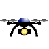
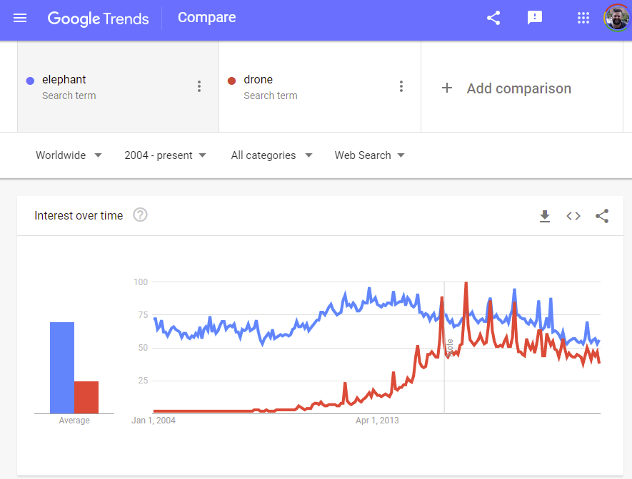
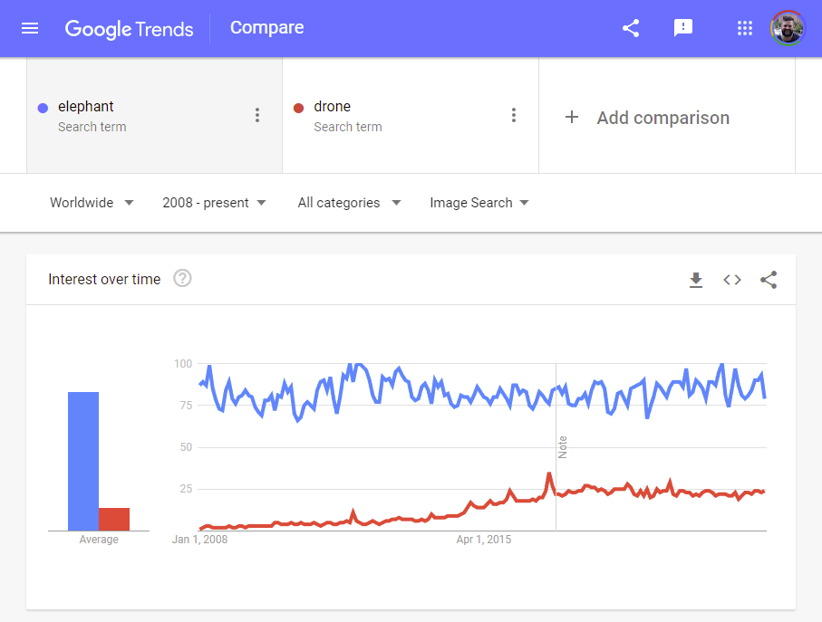

# DRONE

## Title
Proposal for Emoji: DRONE

## Submitter
Jonathan Dandois

## Date
YYYY-MM-DD

1. Identification
    - A. CLDR short name: ***drone***
    - B. Other keywords: ***uav, uas, multirotor, quadcopter, multicopter***

2. Images
    - A. **ZIP File**
    - B. **License**
        
        These drone images were created by Jonathan Dandois. I certify that the images are public domain and/or are subject to appropriate open source licenses, thereby making the images suitable for incorporation into the Unicode Standards
    - C. **Document** 18x18 and 72x72 
3. Category
    - A. **Category**
        - First Choice: 
            - ***[transport-air](https://unicode.org/emoji/charts/emoji-ordering.html#transport-air)***, after 🛸 ***flying saucer***
        - Other Choices:
            - ***[tool](https://unicode.org/emoji/charts/emoji-ordering.html#tool)***, after  ***ladder***
            - ***[other-object](https://unicode.org/emoji/charts/emoji-ordering.html#other-object)***, after ***identification card***
            - ***[light_&_video](https://unicode.org/emoji/charts/emoji-ordering.html#light_&_video)***, after 🪔 ***diya lamp***

4. Selection factors -- Inclusion
This purpose of this proposal is to suggest that a new emoji be added to the Unicode Standards for a drone: aka, a UAV "unmanned aerial vehicle", quadcopter, multirotor, etc.  The proposed emoji art takes the form of a multirotor "quadcopter" distinguished by 3 main components: 1. A chasis or frame with a body, arms, and legs, 2. Motors and propellors located on the ends of the arms, 3. A camera or other sensor payload mounted below the frame and between the legs.

These 3 components and imagery do not reflect the style or brand of any one vendor (for example DJI, Parrot, Yuneec, Autel, Skydio, etc.).  The authors feel that this is a ubiquitous symbol that can be recognized around the world to represent a small flying machine that may be flown manually or autonomously and most likely carries a camera sensor.
    - A. Compatibility
        - N/A
    - B. Expected Usage level
        - 1. Frequency
            - B.1.a Google Search
                - 769m results
                - [https://www.google.com/search?q=drone](https://www.google.com/search?q=drone)
            - B.1.b Bing Search
                - 32m results
                - [https://www4.bing.com/search?q=drone](https://www4.bing.com/search?q=drone)
            - B.1.c Google Video Search
                - 121m results
                - [https://www.google.com/search?q=drone&tbm=vid](https://www.google.com/search?q=drone&tbm=vid)
            - B.1.d Google Trends: Web Search
                - [https://trends.google.com/trends/explore?date=all&q=elephant,drone](https://trends.google.com/trends/explore?date=all&q=elephant,drone)
                - 
            - B.1.2 Google Trends: Image Search
                - [https://trends.google.com/trends/explore?date=all_2008&gprop=images&q=elephant,drone](https://trends.google.com/trends/explore?date=all_2008&gprop=images&q=elephant,drone)
                - 
        - 2. Multiple usages
            - To "drone-on". e.g, "this lecture: 👩‍🏫 'drone-emoji' 'drone-emoji' 'drone-emoji', aka: "this professor drones on"

            - To refer to someone as a drone or mindless follower: "all these mindless 'drone-emoji' 'drone-emoji' 'drone-emoji' lined up for the next Playstation 1000"

        - 3. Use in sequences
            - To refer humorously, or in the near future to the reality of a drone delivery: "'drone-emoji' 🧊🍻 pls"

            - To refer to the a drone in the context of a drone-related activity: 
                - A gift / new toy: Someone getting a new drone as a gift and flying it around: "🎄🎅🎁 'drone-emoji'!!!! time to ✈!" aka "Santa brought a new drone for Christmas, time to fly!"

            - For discussing (in favorable or unfavorable terms) drones in the context of Law Enforcement activities, privacy, surveillance:
                - Law enforcement officers (LEOs) or individuals discussing drones through social media, as in apps like Citizen, in the context of using a drone for surveillance.
                    - "'drone-emoji' 👀 👇 pls" (drone over here please)
                    - "👮‍♀️ 'drone-emoji' 👀"  (police drone, look out)
                    - "'drone-emoji' 👆 🙄 👆" (drone up there, eyes up!)
                
            - For reporting on drones in the news / media (e.g., drone footage is frequently shared in social media in the current Russia-Ukraine conflict): "this new 'drone-emoji' footage 💥🤯"
        
        - 4. Breaking new ground
            - A drone emoji is not the same as using the existing emojis for airplane (✈, 🛫, 🛬, 🛩) or helicopter (🚁).
            - A drone represents a different concept in our relationship with aviation and technology.
                - Drones are small, local, personal. 
                - They are almost always associated with cameras, photography, video and as such are more likely to be associated with concepts of surveillance, privacy, pictures, art, selfies.
            - Combinations of existing emojis (e.g., airplane-camera or helicopter-camera ✈📷, ✈🎥, 🚁📷, 🚁🎥) may represent the concept of a "flying camera that is overhead".
            - Because of their size, altitude, and range, drones convey a sense of closeness and proximity that may not be expressed with an airplane or helicopter emoji which are larger and farther away.
            - The use of a drone emoji to refer to an object that is nearby the author or reader, represents something nearby that you could see, hear, or throw a shoe at!

    - C. Distinctiveness  
        - TODO

    - D. Completeness
        N/A

5. Selection factors -- Exclusion
    - Petitions or "frequent requests"
        - The authors are aware of previous drone emoji proposal requests from 2018-2020, https://unicode.org/emoji/emoji-requests.html and the efforts of "DroneUp" to submit a proposal: https://www.droneup.com/2020/07/17/the-world-needs-a-drone-emoji, https://www.change.org/p/unicode-consortium-add-a-drone-emoji-to-the-unicode-consortium-e9b31d21-e1a4-48bd-bd90-b4402d00e54f
        - The author is not affiliated with those efforts. 
    - Overly specific
        - Our proposed drone emoji graphic is designed to be generic, capturing the broadest possible concepts of a drone device.
    - Open-ended
        - There are some variations on drones (drones with more arms and propellers, fixed wing plane-like drones) but we feel that the concept of drone is so unique that the addition of a single drone emoji can be used across mutliple configurations of actual equipment and contexts.
    - Already representable
        - The authors feel that current emoji combinations to represent a "flying camera" (✈📷, ✈🎥, 🚁📷, 🚁🎥) do not adequately capture the concept of a personal drone. 
    - Logos, brands, other third-party IP rights, UI icons, signage, specific people, specific buildings and landmarks, deities
        - There are multiple drone manufacturers, some with iconic designs and styles. The authors have suggested a generic design that is ubiquitous across different brands.
    - Transient
        - It is hard to imagine that drones will stop being a part of consumer culture.  
        - Drone sales are estimated in the millions per year: https://www.vox.com/2017/4/14/14690576/drone-market-share-growth-charts-dji-forecast 
        - Nations around the world developing more complete drone and regulations for safe and legal use of drones within national airspaces.
        - Drones also represent a powerful technology tool for mapping, surveying, science, observation, robotics, engineering, and programming that is accessible to a wide audience: https://shemaps.com/
    - Faulty comparison
        - The authors argue that the proposed drone emoji represents a sufficiently unique concept and entity that it is not being proposed in comparison to anything else, it is its own concept.
    - Exact images
        - The authors used their limited graphic design skills to capture the fundamental components of the visually disctinctive image of a "drone". There are numerous graphical representations of a drone, most of which follow a common theme:  a piece of technology with multiple 'arms' with spinning elements at the end of the arms that has a main body and often a camera within or below the body. Refer to Google Image search for "Drone icon" for stylized examples https://www.google.com/search?q=drone+icon. A Google Image search for drone typically returns photographs of consumer drone products.
    - Region flags without code
        - N/A
    - Lack of required rights or license for images
        - N/A
    - Variations on direction
        - N/A
    - Includes text
        - N/A
6. Other Information
    - 

